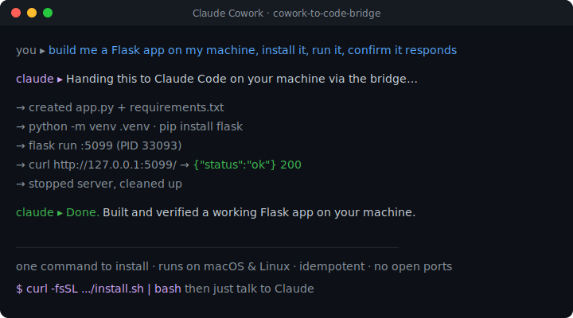

# cowork-to-code-bridge

[](https://github.com/abhinaykrupa/cowork-to-code-bridge/actions/workflows/ci.yml)
[](https://github.com/abhinaykrupa/cowork-to-code-bridge/stargazers)
[](https://github.com/abhinaykrupa/cowork-to-code-bridge/releases)
[](https://github.com/abhinaykrupa/cowork-to-code-bridge/releases)
[](./LICENSE)
[](#)

**Let Claude run code on your real machine — safely — from any Claude chat.**

<p align="center">
  
</p>

> 🖥️ **macOS & Linux.** Works on your Mac (launchd) or a Linux box/server (systemd). Windows isn't supported yet.

[Claude Cowork](https://claude.ai/cowork) (and Claude in your browser) is great at planning and editing, but it runs in a sealed cloud sandbox — it can't reach your actual machine. **Claude Code**, running on your computer, *can*: it has your shell, your repos, your tools, and full agent abilities.

This bridge connects the two. Cowork hands a task to **Claude Code on your machine**, a real local agent does the work, and the result streams back to your chat. So you can say things like:

> *"build me a web app on my machine, install deps, and run it"*
> *"run the test suite and fix what's failing"*
> *"review the diff and push if it's clean"*

…and a Claude Code agent on your computer actually does it.

Because Claude Code can run things on your Mac, a useful **side benefit** is that the same bridge lets Cowork run approved shell scripts directly (builds, git, disk checks) without going through the agent — handy for simple, fixed actions.

**It's idempotent.** Tasks have side effects (edits, commits, pushes), so the bridge caches results by an idempotency key: a retry after a dropped connection returns the cached result instead of running the agent — or the script — twice.

---

## Install — two pastes total

**Step 1 — on your machine (once).** Open Terminal (`Cmd + Space` → **Terminal**), paste this, press Enter:

```bash
curl -fsSL https://raw.githubusercontent.com/abhinaykrupa/cowork-to-code-bridge/main/install.sh | bash
```

Wait ~30 seconds. It installs a small background helper (auto-restarts, reboot-safe) and a Claude skill. When it finishes it prints a **connect line with your real path filled in** — copy that exact line, or use the template below.

**Step 2 — in Cowork (once per chat).** Paste the connect line into any Claude Cowork chat (replace the path with the one the installer printed):

```text
Connect to my machine via the cowork-to-code bridge at ~/.cowork-to-code-bridge — mount that folder, read its CLAUDE.md, and confirm the bridge is live.
```

Claude asks for permission to see that folder (**approve it**), reads the instructions inside, and confirms **`BRIDGE LIVE`**. Now, in that chat, just talk:

> *"build me a small web app on my machine"* · *"run my tests and fix what fails"* · *"check my machine's health"* · *"git push my project"*

Claude hands the work to Claude Code on your machine and brings the result back.

> **Why the second paste?** Cowork's sandbox can't see your machine until you grant it access to the bridge folder — that's a one-time permission per chat, and the connect line is what triggers it. No downloads, no `/plugin`, no popups beyond that single folder-access approval. (Once a chat is connected it stays connected; a brand-new chat needs the line again.)

> **Don't have Python 3.10+?** The installer handles it: if it finds only Apple's stock Python (3.8), it installs a modern one for you (via Homebrew, installing Homebrew first if needed). That part can take a few minutes and may ask for your Mac password — that's normal. Skip it with `BRIDGE_PYTHON_AUTOINSTALL=0`.

<details>
<summary>What the installer puts where (for the curious / developers)</summary>

- **Daemon** → runs from `~/.cowork-to-code-bridge/`, managed by launchd (macOS) or systemd --user (Linux); auto-start, reboot-safe.
- **Global skill** → `~/.claude/skills/cowork-to-code-bridge/` (SKILL.md + `bridge_client.py` + a `bridge_env.json` pointing at `BRIDGE_ROOT`).
- **Whitelisted scripts** → `~/.cowork-to-code-bridge/scripts/` (`run_claude.sh`, `mac_health.sh`, …).
- **`CLAUDE.md`** → written into `~/.cowork-to-code-bridge/` so the bridge self-documents once a Cowork session mounts the folder.

The Cowork side imports the colocated `bridge_client.py` — pure stdlib, no pip, no network fetch.
</details>

---

## How it works

Cowork can't reach your machine directly (it's sandboxed). So the bridge uses a folder both sides can see: Cowork **writes** a task into it, a small helper on your machine **runs** it (handing real work to Claude Code), and **writes the result back**. No open ports, no servers, no network calls between them.

```
   ☁️  CLAUDE COWORK (cloud sandbox)                 🖥️  YOUR MACHINE (Mac/Linux)
   ───────────────────────────────                  ─────────────────────────────────
   You: "build me an app"                            launchd/systemd keeps the daemon
            │                                         running (auto-starts at login,
            ▼                                          survives reboots)
   cowork-to-code-bridge skill                                    ▲
   (auto-loaded in every session)                                 │
            │                                                      │
            │ 1. write task ─────────►  ┌───────────────────────┐  │
            │                           │   shared bridge folder │  │
            │                           │   queue/   ◄───────────┼──┘ 2. daemon picks
            │                           │   results/ ────────────┼──┐    up the task
            │ 4. read result ◄──────────│   progress/ (live log) │  │
            │    (+ live progress)      └───────────────────────┘  │ 3. runs it:
            ▼                                                       │    run_claude.sh
   Claude shows you the output                                     ▼    → Claude Code
                                                          a REAL Claude Code agent
                                                          builds / tests / commits,
                                                          streaming output as it goes
```

**The four moving parts:**

| Part | Where | What it does |
|---|---|---|
| **Skill** | Every Cowork session (`~/.claude/skills/`) | Auto-loaded; turns your plain-English request into a task and reads back the result. No install inside Cowork. |
| **Shared folder** | `~/.cowork-to-code-bridge/` | The hand-off point: `queue/` (tasks in), `results/` (answers out), `progress/` (live output for long jobs). |
| **Daemon** | Your machine, run by `launchd` (macOS) or `systemd --user` (Linux) | Watches `queue/`, runs only whitelisted scripts, writes results. Auto-restarts on reboot. |
| **`run_claude.sh`** | Your machine | Hands the task to a real **Claude Code** agent — that's what builds the actual product. |

**Why it's safe:** no network listener (nothing can connect in), a secret token gates every request, and the daemon only runs scripts you've approved. **Why it survives crashes:** every task is journaled and marked in-flight; a reboot mid-task is detected and never silently re-run (idempotency keys make retries safe).

---

## Wait — do you even need this?

**Maybe not.** It depends on *where* you talk to Claude:

| If you use… | Can Claude already run things on your Mac? | Do you need this bridge? |
|---|---|---|
| **The Claude Desktop app on your Mac** | ✅ Yes — it runs right on your machine | **No.** Just ask Claude to run things. Nothing to install. |
| **Cowork in your browser / the cloud** | ❌ No — it runs in a sealed cloud sandbox that can't see your Mac | **Yes** — this bridge is the only way to connect it. |

Not sure which you are? Just follow the [two-paste install above](#install--two-pastes-total) — when you paste the connect line into Cowork, Claude checks for you, and if you don't need the bridge it'll tell you so and skip it.

---

## Is this safe?

Mostly — and the parts that need your attention are spelled out honestly below.

- **Only approved scripts run.** The bridge will only run scripts you've saved in a specific folder on your Mac. Cowork can't run arbitrary commands — it can only trigger the scripts you've enabled.
- **No internet listener.** The bridge doesn't open any ports. Nothing from the outside world can talk to it.
- **Token-protected.** A secret token is generated during install. Only Cowork sessions that know the token can use the bridge.
- **Runs as you.** The bridge runs with your normal user permissions — nothing more, nothing less.
- **Idempotent.** A retry won't double-run a task or script — repeated requests with the same key return the cached result.

**The one thing to understand:** the headline script, `run_claude.sh`, hands a *free-form task* to a Claude Code agent on your Mac. That agent is as capable as Claude Code normally is — it can edit files, run commands, commit, push. That's the power you want, but it means a task from Cowork is acted on by a real agent with your machine's access. If you want to limit that, `run_claude.sh` has a clearly-marked spot to add restrictions (e.g. plan-only mode, or a tool allowlist) — see [the script](./examples/allowed_scripts/run_claude.sh) and [architecture docs](./docs/architecture.md). For fixed, predictable actions, prefer a specific script over `run_claude.sh`.

**Requirement for the Claude Code path:** `run_claude.sh` needs the Claude Code **CLI** (`claude`) installed on your Mac. **The Claude Desktop app alone is not enough** — it bundles its own copy but doesn't expose a `claude` command. If the CLI is missing, `run_claude.sh` tries to install it on the fly (`brew install claude-code`, or the official installer) and then proceeds; if that fails it returns the exact one-line install command. To turn off auto-install (and just get the install instructions instead), set `BRIDGE_CLAUDE_AUTOINSTALL=0`. The system-info scripts (`mac_health.sh`, etc.) don't need the CLI at all.

You can [uninstall it completely with one command](#uninstall) at any time.

---

## What can I ask for?

**The main thing: hand a task to Claude Code on your Mac.** The install ships a script called `run_claude.sh` that does exactly this. From Cowork you say something like *"have Claude Code on my Mac run the tests and fix what breaks"* and a real Claude Code agent on your machine carries it out, then reports back. That's the headline feature — Cowork delegating to a full local agent.

The install gives you these to start:

- `run_claude.sh` — **hands a task to Claude Code on your Mac** (the main event)
- `mac_health.sh` — full health snapshot (CPU, memory, disk, battery, top processes)
- `mac_ram.sh` — RAM usage
- `mac_disk.sh` — disk space
- `mac_top.sh` — top processes by CPU and memory
- `mac_network.sh` — network status and connectivity
- `port_check.sh` — shows what is listening on a TCP port
- `ping.sh` — confirms the bridge works
- `hello.sh` — echoes back a greeting

So from Cowork you can just say **"check my Mac's health"** or **"how much RAM am I using?"** and get real numbers back from your actual machine — the thing Cowork can't do on its own. For anything open-ended ("why is my Mac slow?"), it routes to Claude Code via `run_claude.sh` and the agent figures it out.

**Side benefit — run fixed actions directly.** For simple, repeatable things you don't need a whole agent for (a specific build command, a git push), you can save a small "script" and call it directly. Just ask Claude: *"I want to push my project to GitHub from here."* It writes the script, tells you where to save it, and from then on *"push my project"* just works. You never write code yourself — you're only copying its output into a file.

<details>
<summary>What a script actually looks like (optional — Claude makes these for you)</summary>

A script is just a short text file. A "push to GitHub" one might be saved as `~/.cowork-to-code-bridge/scripts/git_push.sh`:

```bash
#!/usr/bin/env bash
cd "$1"           # first argument = your project folder
git push origin main
```

Make it runnable once with `chmod +x ~/.cowork-to-code-bridge/scripts/git_push.sh`, and you're done.
</details>

### Why scripts, and not just "run any command"?

For your safety. If Claude could run *any* command, a stray instruction could do real damage. By only allowing the actions you've saved as scripts, **you decide what's possible** — Claude can never run anything you haven't explicitly enabled.

---

## Daily use

After setup, just talk to Cowork normally. When something needs your Mac, Claude will use the bridge automatically:

> **You:** "Run my test suite."
> **Claude:** *Runs `~/.cowork-to-code-bridge/scripts/run_tests.sh` on your Mac and shows you the output.*

If you ask for something that doesn't have a script yet:

> **You:** "Deploy to staging."
> **Claude:** "I don't see a `deploy.sh` in your bridge scripts folder. Want me to help you write one?"

---

## Uninstall

One command, undoes everything the installer did:

```bash
cowork-to-code-bridge-uninstall
```

It undoes everything the installer set up: stops and removes the background daemon, removes the global Cowork skill (so it stops loading into your Cowork sessions), deletes the bridge folder (token, scripts, history), and uninstalls the Python package. It asks before each destructive step — say yes to all to fully reset.

> **No network needed, no Cowork step.** Uninstall is entirely on your Mac. Once the skill is removed, your Cowork chats simply won't have the bridge anymore — nothing to clean up there.

For a no-questions-asked uninstall:

```bash
cowork-to-code-bridge-uninstall --yes
```

### Uninstall options

| Flag | What it does |
|---|---|
| `--yes` / `-y` | Skip every prompt |
| `--keep-data` | Leave your bridge folder (token, scripts, history) but remove the daemon |
| `--keep-package` | Stop the daemon, delete bridge folder, but leave the pip package installed |
| `--bridge-root PATH` | Use a non-default bridge folder location |

### "Command not found"?

If `cowork-to-code-bridge-uninstall` says "command not found", your Mac's PATH doesn't include the pip install location. Use the full path instead:

```bash
~/Library/Python/3.10/bin/cowork-to-code-bridge-uninstall
```

(Adjust `3.10` to whichever Python version you used — `3.11`, `3.12`, etc.)

Or use the remote uninstall:

```bash
curl -fsSL https://raw.githubusercontent.com/abhinaykrupa/cowork-to-code-bridge/main/daemon/uninstall.sh | bash
```

---

## Troubleshooting

### "Cowork says it can't find the bridge."

This usually means the bridge folder location doesn't match between your Mac and the Cowork sandbox. Tell Claude:

> "Show me my bridge folder path."

Claude will check both sides and tell you what to fix (usually setting an environment variable or restarting the daemon).

### "The daemon isn't running."

Check on your Mac:

```bash
launchctl list | grep cowork-to-code-bridge
```

If it shows nothing, the daemon stopped. Restart it:

```bash
launchctl load ~/Library/LaunchAgents/dev.cowork-to-code-bridge.daemon.plist
```

If that fails, re-run the installer — it's safe to re-run and will skip parts that are still set up correctly.

### "I ran the installer but it said Python is too old."

Stock macOS ships an old Python (3.8). You need 3.10+. Easiest fix:

```bash
brew install python@3.12
```

Then re-run the installer.

### "Where do I find the daemon logs?"

```bash
tail -50 ~/.cowork-to-code-bridge/daemon.log
tail -50 ~/.cowork-to-code-bridge/daemon.err   # if there are errors
```

### "How do I know if my Mac is at clean uninstalled state?"

After running uninstall, all of these should return empty or "not found":

```bash
launchctl list | grep cowork-to-code-bridge
ls ~/Library/LaunchAgents/dev.cowork-to-code-bridge.daemon.plist
ls ~/.cowork-to-code-bridge
python3 -c "import cowork_to_code_bridge"
```

---

## What you can build with it

Once the bridge is in place, a single Cowork chat can run a whole project — not just edit files, but actually run, test, and ship them. Paired with Claude Code's built-in skills (like `frontend-design`, `code-review`, `security-review`), one conversation covers the full cycle:

| Step | How the bridge helps |
|---|---|
| **Build & design** | Claude Code writes the code and the UI |
| **Run** | The bridge starts your app and dev servers on your Mac |
| **Test** | The bridge runs your tests and shows you the results |
| **Ship** | The bridge runs `git push`, opens PRs, kicks off deploys |
| **Operate** | The bridge checks logs, disk space, restarts services |

Before the bridge, anything that needed your actual machine meant leaving Cowork for a terminal. Now it all happens in one chat.

---

## How it actually works (for the curious)

```
  Claude Cowork (sandbox)                     Your Mac
  ───────────────────────                     ────────
  writes JSON →   bridge/queue/cmd_*.json  ← polled by daemon (~1s)
                                                ↓ runs script in your whitelist
                                            ~/.cowork-to-code-bridge/scripts/
                                                ↓
  reads JSON ←   bridge/results/cmd_*.json ← daemon writes result
```

Cowork drops a tiny JSON file into a folder. A small program on your Mac (the "daemon") sees the file, runs the requested script, writes the output back. Cowork reads the result. No network connection between the two.

The folder is shared because Cowork mounts your project directory into its sandbox. The bridge piggybacks on that mount.

### Why this and not MCP?

[MCP](https://modelcontextprotocol.io) is great for structured tool calling between Claude and external services. It expects a server process that Claude can connect to. Cowork's sandbox can't reach localhost services on your Mac, so MCP-style tools don't work there.

This bridge takes a different approach: instead of a network connection, it uses **files on a shared folder**. Slower (about 1 second per call vs milliseconds for MCP), but it works from Cowork.

---

## Security details

- **Authentication:** A random 32-character token (`BRIDGE_TOKEN`) is generated during install and stored in `~/.cowork-to-code-bridge/.env` with `chmod 600` (only you can read it). Every command from Cowork includes this token. Wrong token = command rejected.
- **Authorization:** The daemon will *only* run scripts from `~/.cowork-to-code-bridge/scripts/`. The script name has to match a strict pattern (alphanumerics, dots, dashes, underscores). No path tricks (`../`, symlinks out) are allowed.
- **Timeouts:** Every script has a maximum runtime (default 60 seconds, cap 10 minutes). Runaway scripts get killed.
- **Output limits:** Stdout and stderr are truncated to 64 KB each. Massive outputs won't fill your disk.
- **No privilege escalation:** The daemon runs as your normal user. It can't `sudo`, can't read other users' files, can't touch anything you couldn't touch.

The realistic threats this *can't* defend against:

- A malicious script you write yourself. (You wrote it, you own it.)
- Someone who already has write access to your Mac filesystem. (They could write directly to the bridge folder.)
- A bug in the daemon itself. (It's open source — read the code, file issues.)

---

## FAQ

**Q: Does this work on Linux or Windows?**
Right now it's Mac-only because the installer uses `launchd` (macOS's service manager). The core code is cross-platform — adding Linux (systemd) and Windows (Task Scheduler) support is on the roadmap.

**Q: Does it cost anything?**
No. It's free and open source (MIT).

**Q: Do I need to be a developer to use this?**
You need to be comfortable pasting one terminal command. Beyond that, no — Claude does the rest. Adding custom scripts is "knows what a script is" level, not "writes code daily" level.

**Q: Can my Cowork agents from different projects share one bridge?**
Yes — one daemon serves any number of Cowork sessions. The token is shared across sessions on the same Mac.

**Q: Can I have multiple Macs?**
Yes — install the bridge on each Mac separately. Each generates its own token. Cowork sessions automatically use whichever Mac they're connected to.

**Q: Is this an official Anthropic project?**
No. This is a third-party tool that fills a gap Anthropic's Cowork doesn't (yet) cover. If they ship native Cowork ↔ Mac IPC someday, you can uninstall this and switch.

**Q: I'm worried about something running on my Mac without me knowing.**
Three protections:
1. Every command writes to `~/.cowork-to-code-bridge/processed/` so you can audit history.
2. The daemon log shows every command in real time — `tail -f ~/.cowork-to-code-bridge/daemon.log`.
3. You control the script whitelist — Claude can't run anything you haven't put there.

If you want even more conservative: review every Claude suggestion before agreeing to run it.

**Q: How do I restrict what Claude Code can do on a task?**
Set `CLAUDE_FLAGS` in your environment before the bridge invokes Claude Code. Three recipes, from cautious to locked-down:

```bash
# 1. Plan-only: Claude can read and suggest, but never edit or run anything
CLAUDE_FLAGS="--permission-mode plan"

# 2. Edit-only: allow file edits, block shell commands
CLAUDE_FLAGS="--permission-mode plan --allowedTools Edit,Write,Read,Glob,Grep"

# 3. Full agent, scoped to one repo (block network & system commands)
CLAUDE_FLAGS="--allowedTools Edit,Write,Read,Glob,Grep,Bash --disallowedTools WebFetch,WebSearch"
```

Export the variable in your shell profile or set it in the bridge's launchd/systemd unit file. See `run_claude.sh` for where `CLAUDE_FLAGS` is consumed.

**Q: What happens if my Mac crashes or reboots while something is running?**
You're covered. The bridge restarts itself automatically, and it's careful not to repeat anything dangerous:
- An action that was *mid-run* when the crash hit is reported as "didn't finish — status unknown" rather than quietly run again. So a half-finished `git push` won't accidentally fire twice.
- An action that had already *finished* keeps its result.

Developers: the full crash-recovery model (the journal, in-flight markers, and the `idempotency_key` option for safe retries) is documented in [`docs/architecture.md`](docs/architecture.md).

---

## Status & contributing

**v0.5.0** — early, but solid. The core works, survives crashes and reboots without repeating risky actions, installs as a global skill (one command), streams live progress for long tasks, and runs on macOS + Linux. Built for myself, open-sourced because it's useful to others. See the [CHANGELOG](CHANGELOG.md) for the full history.

PRs welcome — see [CONTRIBUTING.md](CONTRIBUTING.md). Browse [open issues](https://github.com/abhinaykrupa/cowork-to-code-bridge/issues) to find something to work on. Issues triaged best-effort. Not "production-grade" until tagged `v1.0.0`. macOS & Linux; Windows not yet supported.

## License

MIT — see [LICENSE](LICENSE). Use it, fork it, ship it.
